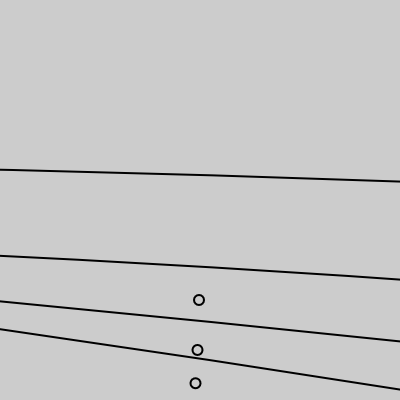

# P5js Sketches by Chadwick Strange

Storage place for all my basic sketches.

Requires p5js library

Animated gifs created by `saveFrames()` function and ImageMagick command line:

`convert -delay 4 -size 360x360 -loop 0 <SOURCE-FILENAME>*.png <TARGET-FILENAME>.gif`
